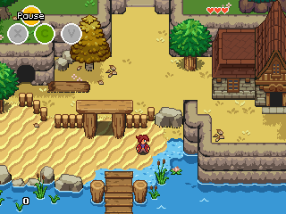

# Solarus

**Solarus** is a free and open-source 2D game engine written in C++, that can run games scripted in Lua. It has been designed with 16-bit classic Action-RPGs in mind, and is available on a wide range of platforms.

You'll find more information about Solarus on <https://www.solarus-games.org>, such as downloads, games, news, tutorials and more.

Solarus has a CLI, `solarus-run` and a GUI launcher, [Solarus Launcher](https://gitlab.com/solarus-games/solarus/gui).

Solarus also features a graphical game creation editor called [Solarus Quest Editor](https://gitlab.com/solarus-games/solarus-quest-editor), that allows you to create maps, sprites and scripts with ease.

## Compilation

To compile Solarus, instructions can be found in the [compilation.md](compilation.md) file.

## Create your own game

See [tutorials](https://www.solarus-games.org/en/development/tutorials) (video and text), and [documentation](https://www.solarus-games.org/doc/latest/) on Solarus website.

## License

The source code of Solarus is licensed under the terms of the [GNU GPL v3](https://www.gnu.org/copyleft/gpl.html).

Resources made for Solarus are licensed under the terms of the [CC BY-SA 3.0](http://creativecommons.org/licenses/by-sa/3.0/).

## Donate

Solarus is backed by [Solarus Labs](https://www.solarus-games.org/en/about/nonprofit-organization), a nonprofit organization under French law. All your donations will be totally reinvested into the project.

